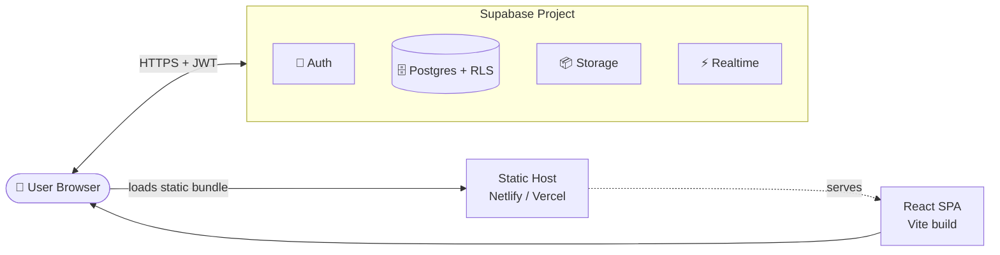
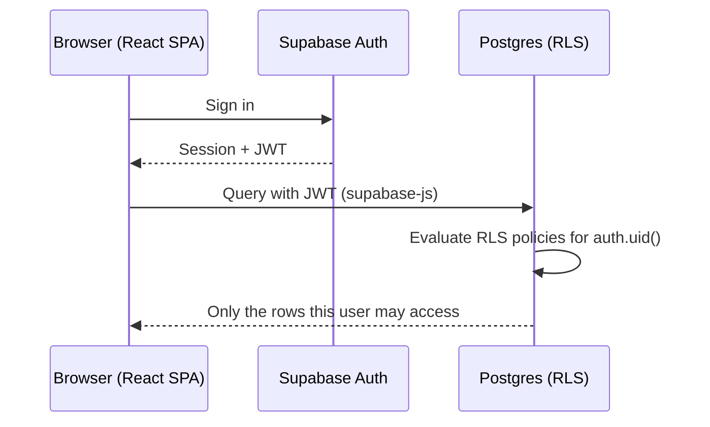
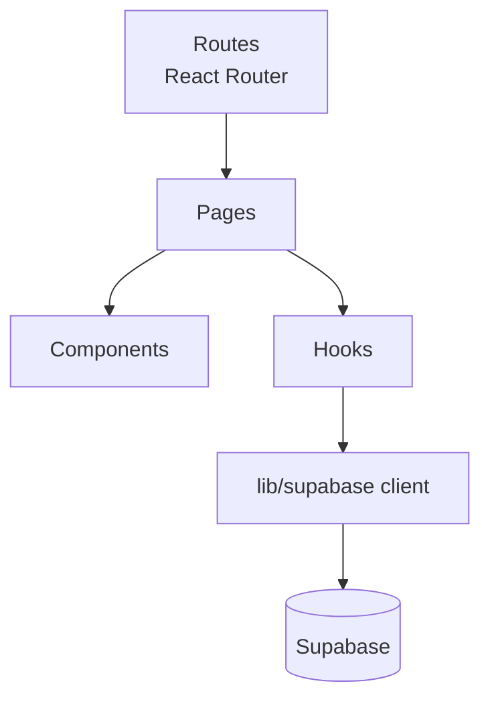
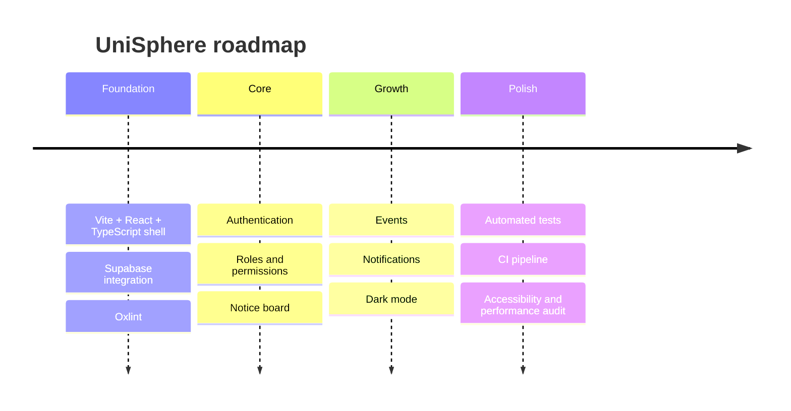

<!-- markdownlint-disable MD033 MD041 -->

<div align="center">


<a href="https://github.com/Aiet-Unisphere/AIET-UniSphere">
  
</a>

<br />

<p>
  <a href="https://react.dev"></a>
  <a href="https://www.typescriptlang.org"></a>
  <a href="https://vite.dev"></a>
  <a href="https://supabase.com"></a>
  <a href="https://reactrouter.com"></a>
</p>

<p>
  
  
  
  
  
  
  
</p>

<h3>A fast, modular, secure campus platform for Alva's Institute of Engineering and Technology.</h3>

<p>
  <a href="#-quick-start"><b>Quick Start</b></a> ·
  <a href="#-architecture"><b>Architecture</b></a> ·
  <a href="#-supabase-setup"><b>Supabase</b></a> ·
  <a href="#-building-a-new-module"><b>Build a Module</b></a> ·
  <a href="#-deployment"><b>Deploy</b></a> ·
  <a href="#-contributing"><b>Contribute</b></a>
</p>

</div>

---

## 📑 Table of Contents

<details>
<summary><b>Click to expand</b></summary>

1. [At a Glance](#-at-a-glance)
2. [Overview](#-overview)
3. [Features](#-features)
4. [Tech Stack](#-tech-stack)
5. [Architecture](#-architecture)
6. [Project Structure](#-project-structure)
7. [Quick Start](#-quick-start)
8. [Environment Variables](#-environment-variables)
9. [Supabase Setup](#-supabase-setup)
10. [Building a New Module](#-building-a-new-module)
11. [Scripts](#-scripts)
12. [Code Quality and Conventions](#-code-quality-and-conventions)
13. [Deployment](#-deployment)
14. [Continuous Integration](#-continuous-integration)
15. [Roadmap](#-roadmap)
16. [Contributing](#-contributing)
17. [Security](#-security)
18. [FAQ and Troubleshooting](#-faq-and-troubleshooting)
19. [Contributors](#-contributors)
20. [License](#-license)
21. [Acknowledgements](#-acknowledgements)

</details>

---

## ⚡ At a Glance

| | |
|:--|:--|
| **What** | A single-page web app that brings campus services into one place |
| **Frontend** | React 19, TypeScript 6, Vite 8, React Router 7 |
| **Backend** | Supabase: Auth, Postgres, Storage, Realtime, with no custom server |
| **Security model** | JWT sessions plus Row Level Security enforced in the database |
| **Hosting** | Any static host (Netlify, Vercel, GitHub Pages, Cloudflare Pages) |
| **Setup time** | About 5 minutes from clone to running locally |
| **Linting** | Oxlint, which is fast enough to run on every save |

---

## 🎯 Overview

Campus information is usually scattered across notice boards, group chats and separate portals. **AIET UniSphere** brings it together in one responsive web app that works on phones, tablets and desktops.

### Design principles

| Principle | What it means in practice |
|:--|:--|
| 🧩 **Modular** | New campus services are added as self-contained modules (a route, a page and a table) without touching the rest of the app |
| 🛡️ **Secure by default** | Authorization lives in Postgres through RLS, so the browser is never trusted |
| ⚡ **Fast** | Static bundle, instant HMR in development, no server round trips for the shell |
| 🧱 **Typed end to end** | TypeScript across the codebase, with types that can be generated from the database schema |
| 🚢 **Easy to ship** | One build command, static output, deploy anywhere |

---

## ✨ Features

<table>
<tr>
<td width="50%" valign="top">

### 🔐 Authentication
Sign-up, login and session handling with Supabase Auth and JWT sessions.

### 🗄️ Managed database
Postgres schema, migrations and policies versioned in [`supabase/`](./supabase).

### 🛡️ Row Level Security
Access rules enforced inside the database, per user and per role.

</td>
<td width="50%" valign="top">

### 🧭 Seamless navigation
Client-side routing with React Router 7. Instant transitions and deep-linkable URLs.

### 🎨 Responsive UI
React 19 components with [Lucide](https://lucide.dev) icons, designed mobile-first.

### ⚡ Great developer experience
Vite HMR, strict TypeScript and Oxlint for instant feedback.

</td>
</tr>
</table>

### Module status

> [!NOTE]
> This table tracks the campus modules. Update the status column as modules ship.

| Module | Description | Status |
|:--|:--|:--:|
| Foundation | Vite and React shell, routing, Supabase client, linting | ✅ Done |
| Authentication | Sign-up, login, session persistence | 🚧 In progress |
| Notice board | Campus-wide announcements | 📋 Planned |
| Events | Campus events and registrations | 📋 Planned |
| Roles and permissions | Student, faculty and admin access | 📋 Planned |
| Notifications | In-app and realtime alerts | 📋 Planned |

---

## 🛠 Tech Stack

| Layer | Technology | Why |
|:--|:--|:--|
| **UI framework** | [React 19](https://react.dev) | Component model with modern concurrent features |
| **Language** | [TypeScript 6](https://www.typescriptlang.org) | Type safety across the codebase |
| **Build tool** | [Vite 8](https://vite.dev) with `@vitejs/plugin-react` | Near-instant dev server and optimized builds |
| **Routing** | [React Router DOM 7](https://reactrouter.com) | Declarative client-side routing |
| **Backend (BaaS)** | [Supabase](https://supabase.com) via `@supabase/supabase-js` | Auth, Postgres, storage, realtime |
| **Icons** | [Lucide React](https://lucide.dev) | Consistent, lightweight icon set |
| **Linting** | [Oxlint](https://oxc.rs) | Rust-powered linter, very fast |

---

## 🏗 Architecture

### System overview



### Authentication and data flow



### Frontend layering



**How it fits together**

1. The browser downloads the static Vite bundle from any static host.
2. `@supabase/supabase-js` creates a client from the project URL and publishable key.
3. Users authenticate and receive a JWT.
4. Every query carries that JWT, and RLS policies decide what each user can read or write.

---

## 📂 Project Structure

```text
AIET-UniSphere/
├── public/                  # Static assets served as-is
├── src/                     # Application source code
├── supabase/                # Supabase config, migrations and policies
├── .env.example             # Template for required environment variables
├── .gitignore
├── .oxlintrc.json           # Oxlint configuration
├── index.html               # Vite HTML entry point
├── package.json             # Dependencies and npm scripts
├── tsconfig.json            # TypeScript project references
├── tsconfig.app.json        # TypeScript config for app code
├── tsconfig.node.json       # TypeScript config for Vite / Node tooling
└── vite.config.ts           # Vite configuration
```

<details>
<summary><b>Recommended layout inside <code>src/</code></b></summary>

```text
src/
├── components/     # Reusable UI components
├── pages/          # Route-level pages (one per route)
├── modules/        # Self-contained feature modules (page + hooks + types)
├── lib/            # Supabase client and shared helpers
├── hooks/          # Shared custom hooks
├── types/          # Shared and generated TypeScript types
└── main.tsx        # Application entry point
```

</details>

---

## 🚀 Quick Start

### Prerequisites

| Tool | Version | Check |
|:--|:--|:--|
| Node.js | 20 or later (22 LTS recommended) | `node -v` |
| npm | 10 or later | `npm -v` |
| Supabase account | Free tier is enough | [supabase.com](https://supabase.com) |

### Run it locally

```bash
# 1. Clone
git clone https://github.com/Aiet-Unisphere/AIET-UniSphere.git
cd AIET-UniSphere

# 2. Install dependencies
npm install

# 3. Create your environment file, then add your Supabase URL and key
cp .env.example .env

# 4. Start the dev server
npm run dev
```

Open **http://localhost:5173** and you're running. 🎉

> [!TIP]
> On Windows PowerShell, use `Copy-Item .env.example .env` instead of `cp`.

---

## 🔑 Environment Variables

| Variable | Required | Description |
|:--|:--:|:--|
| `VITE_SUPABASE_URL` | ✅ | Your Supabase project URL |
| `VITE_SUPABASE_PUBLISHABLE_KEY` | ✅ | Publishable (anon) key from your Supabase project |

Find both in **Supabase Dashboard → Project Settings → API**.

> [!WARNING]
> Vite exposes every variable prefixed with `VITE_` to the browser. Use only the **publishable/anon** key here. Never put a `service_role` key in a `VITE_` variable.

<details>
<summary><b>Example Supabase client</b> (<code>src/lib/supabase.ts</code>)</summary>

```ts
import { createClient } from '@supabase/supabase-js'

const url = import.meta.env.VITE_SUPABASE_URL
const key = import.meta.env.VITE_SUPABASE_PUBLISHABLE_KEY

if (!url || !key) {
  throw new Error('Missing Supabase environment variables. Check your .env file.')
}

export const supabase = createClient(url, key)
```

</details>

---

## 🗄 Supabase Setup

The [`supabase/`](./supabase) folder holds the database definition.

**1. Create a project** at [supabase.com](https://supabase.com) and copy the URL and publishable key into `.env`.

**2. Apply the schema**

<details open>
<summary><b>Option A: Supabase CLI (recommended)</b></summary>

```bash
npx supabase login
npx supabase link --project-ref <your-project-ref>
npx supabase db push
```

</details>

<details>
<summary><b>Option B: SQL Editor</b></summary>

Open the SQL files in `supabase/` and run them in order in the Supabase **SQL Editor**.

</details>

**3. Configure Auth** in **Authentication → Providers** and enable the sign-in methods you need.

**4. Add redirect URLs** in **Authentication → URL Configuration**:

```text
http://localhost:5173
https://your-production-domain.com
```

**5. (Optional) Generate TypeScript types from your schema**

```bash
npx supabase gen types typescript --project-id <your-project-ref> > src/types/database.ts
```

Then pass the types to the client for fully typed queries:

```ts
import { createClient } from '@supabase/supabase-js'
import type { Database } from '../types/database'

export const supabase = createClient<Database>(url, key)
```

<details>
<summary><b>Row Level Security pattern</b> (example)</summary>

Always enable RLS on tables that hold user data:

```sql
alter table public.profiles enable row level security;

create policy "Users can read their own profile"
  on public.profiles for select
  using (auth.uid() = id);

create policy "Users can update their own profile"
  on public.profiles for update
  using (auth.uid() = id);
```

</details>

---

## 🧩 Building a New Module

UniSphere is designed so a new campus service is a small, self-contained change. Example: adding a notice board.

**1. Create a migration**

```bash
npx supabase migration new add_notices
```

```sql
create table public.notices (
  id uuid primary key default gen_random_uuid(),
  title text not null,
  body text not null,
  created_at timestamptz not null default now()
);

alter table public.notices enable row level security;

create policy "Anyone signed in can read notices"
  on public.notices for select
  to authenticated
  using (true);
```

```bash
npx supabase db push
```

**2. Add a page** (`src/pages/Notices.tsx`)

```tsx
import { useEffect, useState } from 'react'
import { supabase } from '../lib/supabase'

type Notice = { id: string; title: string; body: string }

export default function Notices() {
  const [notices, setNotices] = useState<Notice[]>([])

  useEffect(() => {
    supabase
      .from('notices')
      .select('id, title, body')
      .order('created_at', { ascending: false })
      .then(({ data }) => setNotices(data ?? []))
  }, [])

  return (
    <section>
      <h1>Notice Board</h1>
      {notices.map((n) => (
        <article key={n.id}>
          <h2>{n.title}</h2>
          <p>{n.body}</p>
        </article>
      ))}
    </section>
  )
}
```

**3. Register the route** in your router, for example `<Route path="/notices" element={<Notices />} />`.

**4. Verify**

```bash
npm run lint && npm run build
```

---

## 📜 Scripts

| Command | What it does |
|:--|:--|
| `npm run dev` | Starts the Vite dev server with hot module replacement |
| `npm run build` | Type-checks with `tsc -b`, then builds to `dist/` |
| `npm run preview` | Serves the production build locally |
| `npm run lint` | Lints the project with Oxlint |

---

## 🧹 Code Quality and Conventions

- **Strict TypeScript** with project references (`tsconfig.app.json` and `tsconfig.node.json`).
- **Oxlint** configured in [`.oxlintrc.json`](./.oxlintrc.json).
- **Before every PR:**

  ```bash
  npm run lint && npm run build
  ```

| Convention | Rule |
|:--|:--|
| Components | `PascalCase.tsx`, one component per file |
| Hooks | `useCamelCase.ts` |
| Types | `PascalCase`, shared types live in `src/types/` |
| Branches | `feat/…`, `fix/…`, `docs/…`, `chore/…` |
| Commits | [Conventional Commits](https://www.conventionalcommits.org) |

<details>
<summary><b>Enable type-aware linting</b> (recommended for production)</summary>

Install `oxlint-tsgolint` and update `.oxlintrc.json`:

```json
{
  "$schema": "./node_modules/oxlint/configuration_schema.json",
  "plugins": ["react", "typescript", "oxc"],
  "options": { "typeAware": true },
  "rules": {
    "react/rules-of-hooks": "error",
    "react/only-export-components": ["warn", { "allowConstantExport": true }]
  }
}
```

</details>

---

## ☁️ Deployment

`npm run build` outputs a static site to `dist/`, so it can be hosted almost anywhere.

| Setting | Value |
|:--|:--|
| Build command | `npm run build` |
| Output directory | `dist` |
| Environment variables | `VITE_SUPABASE_URL`, `VITE_SUPABASE_PUBLISHABLE_KEY` |

Because the app uses client-side routing, add an SPA fallback so refreshes and deep links don't return 404.

<details>
<summary><b>Netlify</b></summary>

Create `public/_redirects`:

```text
/*    /index.html   200
```

</details>

<details>
<summary><b>Vercel</b></summary>

Create `vercel.json` in the project root:

```json
{
  "rewrites": [{ "source": "/(.*)", "destination": "/index.html" }]
}
```

</details>

<details>
<summary><b>Cloudflare Pages</b></summary>

Set the build command to `npm run build` and the output directory to `dist`. Cloudflare Pages serves `index.html` for unknown routes automatically for SPAs.

</details>

After deploying, add the production URL to Supabase **Authentication → URL Configuration**.

---

## 🔄 Continuous Integration

Add `.github/workflows/ci.yml` to lint and build on every push and pull request:

```yaml
name: CI

on:
  push:
    branches: [main]
  pull_request:

jobs:
  build:
    runs-on: ubuntu-latest
    steps:
      - uses: actions/checkout@v4
      - uses: actions/setup-node@v4
        with:
          node-version: 22
          cache: npm
      - run: npm ci
      - run: npm run lint
      - run: npm run build
        env:
          VITE_SUPABASE_URL: https://placeholder.supabase.co
          VITE_SUPABASE_PUBLISHABLE_KEY: placeholder-key
```

---

## 🗺 Roadmap



- [x] Project scaffold with React, TypeScript and Vite
- [x] Supabase integration and environment configuration
- [x] Linting with Oxlint
- [ ] Complete authentication flow
- [ ] Role-based access (student, faculty, admin)
- [ ] Notice board and events modules
- [ ] Notifications
- [ ] Automated tests and CI pipeline
- [ ] Accessibility and performance audit
- [ ] Dark mode

Have an idea? [Open a feature request](https://github.com/Aiet-Unisphere/AIET-UniSphere/issues/new).

---

## 🤝 Contributing

Contributions are welcome, from typo fixes to whole modules.

1. **Fork** the repository.
2. **Create a branch:**
   ```bash
   git checkout -b feat/your-feature-name
   ```
3. **Commit** with [Conventional Commits](https://www.conventionalcommits.org):
   ```bash
   git commit -m "feat: add event listing page"
   ```
4. **Verify:** `npm run lint && npm run build`
5. **Push** and open a **Pull Request**.

| Prefix | Use for |
|:--|:--|
| `feat:` | A new feature |
| `fix:` | A bug fix |
| `docs:` | Documentation only |
| `refactor:` | A change that neither fixes a bug nor adds a feature |
| `chore:` | Tooling, dependencies, config |

<details>
<summary><b>Pull request checklist</b></summary>

- [ ] `npm run build` passes
- [ ] `npm run lint` passes
- [ ] No secrets or `.env` files committed
- [ ] Database changes include a migration in `supabase/`
- [ ] New tables have RLS enabled and policies written
- [ ] UI checked on mobile and desktop

</details>

For larger changes, please [open an issue](https://github.com/Aiet-Unisphere/AIET-UniSphere/issues) first to discuss the approach.

---

## 🔒 Security

- Never commit `.env` files or any `service_role` key.
- Enable **Row Level Security** on every table that stores user data.
- Treat the publishable key as public. RLS is what protects your data.
- Found a vulnerability? Please **do not open a public issue**. Contact the maintainers privately instead.

---

## 🩺 FAQ and Troubleshooting

<details>
<summary><b>Blank page, with <code>supabaseUrl is required</code> in the console</b></summary>

Your `.env` file is missing or a variable name is wrong. Fix it, then **restart** `npm run dev`, because Vite only reads env files on startup.

</details>

<details>
<summary><b>Login redirects to the wrong URL</b></summary>

Add your local and production URLs in Supabase **Authentication → URL Configuration**.

</details>

<details>
<summary><b>404 when refreshing a page after deploying</b></summary>

Add the SPA fallback rule from the [Deployment](#-deployment) section.

</details>

<details>
<summary><b>Queries return empty data or <code>permission denied</code></b></summary>

Check that RLS policies exist for the table and that you are signed in. With RLS enabled and no policies, nothing is readable.

</details>

<details>
<summary><b>TypeScript errors after pulling new changes</b></summary>

Run `npm install` to sync dependencies, then restart your editor's TypeScript server.

</details>

<details>
<summary><b>Is it safe to expose the Supabase key in the browser?</b></summary>

The publishable (anon) key is designed to be public. Your data is protected by Row Level Security policies, so make sure every table has them. Never expose the `service_role` key.

</details>

---

## 👥 Contributors

<a href="https://github.com/Aiet-Unisphere/AIET-UniSphere/graphs/contributors">
  
</a>

### ⭐ Star history

<a href="https://star-history.com/#Aiet-Unisphere/AIET-UniSphere&Date">
  
</a>

---

## 📄 License

Add a `LICENSE` file to the repository root (for example the [MIT License](https://choosealicense.com/licenses/mit/)) and reference it here.

---

## 🙏 Acknowledgements

- [React](https://react.dev), [Vite](https://vite.dev) and [React Router](https://reactrouter.com)
- [Supabase](https://supabase.com) for the backend platform
- [Lucide](https://lucide.dev) for the icon set
- [Oxc](https://oxc.rs) for the Oxlint linter
- [Shields.io](https://shields.io), [Capsule Render](https://github.com/kyechan99/capsule-render), [readme-typing-svg](https://github.com/DenverCoder1/readme-typing-svg), [contrib.rocks](https://contrib.rocks) and [Star History](https://star-history.com) for the README visuals
- **Alva's Institute of Engineering and Technology (AIET)**

---

<div align="center">

### If this project helps you, give it a ⭐


</div>
